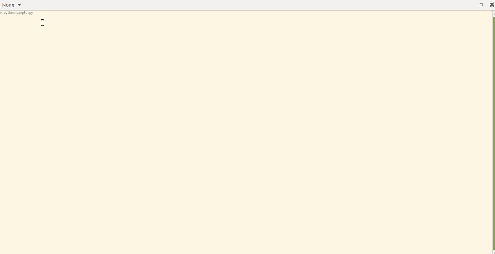

# Wrapper class for Selenium 

This is a wrapper class for the Selenium package. 

Class [SeleniumWrapper](ktxo/scraper/base_scraper.py#L40) provides common operations based on Selenium, serving as a base for developing robots/scrapers.

I developed this class based on my own experience with Selenium, BeautifulSoup, and scrapers/robots.
 
I prefer to maintain control over the version of Chromedriver, so I do not use any automatic downloader for the driver, I use my own tool [chromedriver-downloader ](https://github.com/ktxo/chromedriver-downloader)

Support of [chromedriver](https://chromedriver.chromium.org/downloads) or [undetected-chromedriver](https://pypi.org/project/undetected-chromedriver/)

----

## How to use it?

1. Download chromedriver (optional)
2. Install requirements:
    ```
   pip install -r requirements.txt
   ```
3. Configure [config.json](config.json)
4. Build your app, see [sample.py](sample.py)
   This sample script requires [tabulate](https://pypi.org/project/tabulate/), run `pip install tabulate` to install it.




**~~~~~~~~~~~~~~~~~~~~~~~~~~~~~~~~~~~~~~~~~~~~~~~~~~~~~~~~~~~~~~~~~~~~~**

Any feedback is welcome